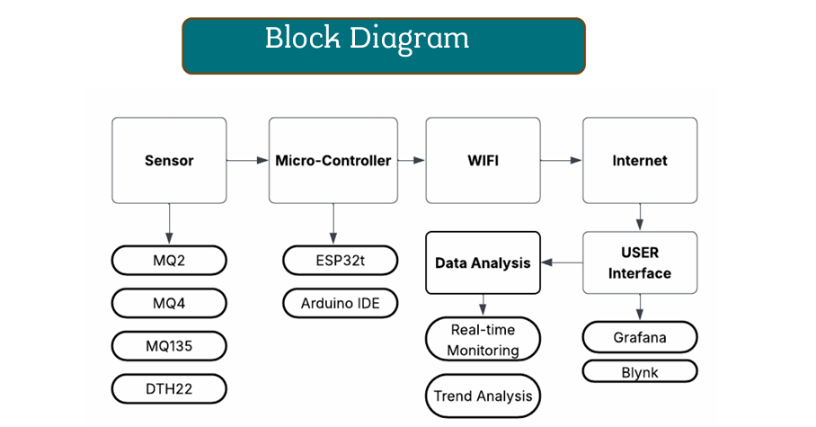
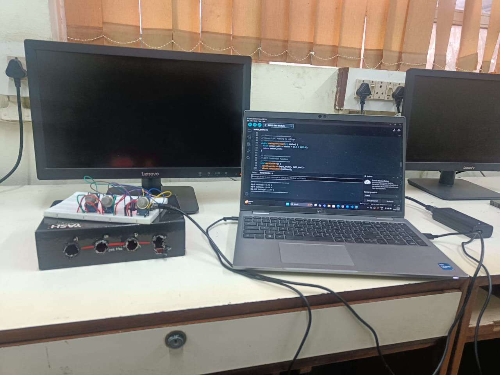

# 🌫️ IoT Air Quality Monitoring System (ESP32 + MQTT + Python + Alerts)

A real-time IoT system that monitors environmental air quality using MQ gas sensors (MQ-2, MQ-4, MQ-135), sends data to an MQTT broker, logs readings to CSV, visualizes trends, and triggers automated email alerts when hazardous levels are detected.

This project uses **ESP32**, **MQTT (EMQX broker)**, **Python (Colab)**, and **Matplotlib** for data visualization.

---

## 🚀 Features

- 🔹 Real-time gas monitoring (MQ-2, MQ-4, MQ-135)
- 🔹 ESP32 reads analog values & publishes via MQTT
- 🔹 Python subscriber logs data into CSV (Google Drive)
- 🔹 Automated email alerts when threshold crosses
- 🔹 Visualization graphs for sensor trends
- 🔹 Clean folder structure for GitHub

---

## 🖼️ System Architecture

  

---

## 🔌 Hardware Setup

### **Components**

- ESP32 Dev Module
- MQ-2 Gas Sensor
- MQ-4 Gas Sensor
- MQ-135 Air Quality Sensor
- Jumper Wires
- Breadboard

  

---

## 📁 Folder Structure
